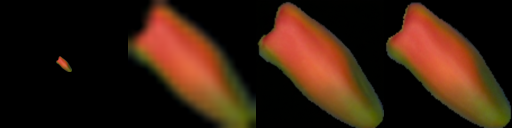
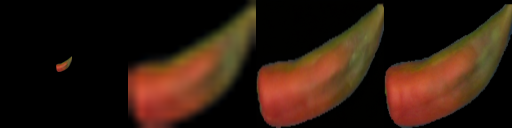
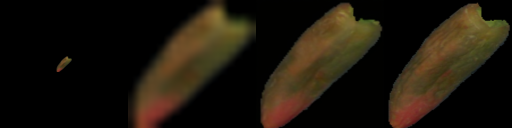
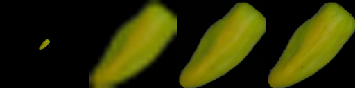
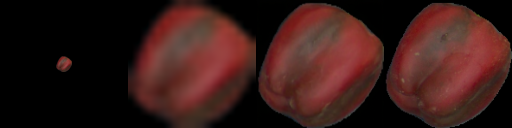
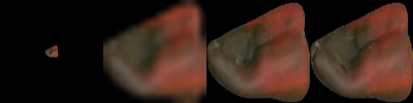
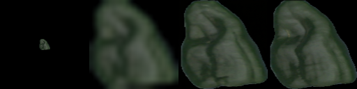

# Image Super-Resolutio for Vegetables via Iterative Refinement

## **Based on these excellent original Works**

[Paper](https://arxiv.org/pdf/2104.07636.pdf ) |[Project](https://iterative-refinement.github.io/ )|
[Code](https://github.com/Janspiry/Image-Super-Resolution-via-Iterative-Refinement)

Please see original paper and unofficial code repo for more details about the method

## Summary
In this work we train the Super resolution SR3 and DDPM models on vegetable dataset ~150000 for vegetable phenotyping
We also added the support to load pretrained model weights trained on celeb dataset without optimizer to decrease training time.

The model is supervised in Self supervised learning fashion so there are no explicti labels required


## Results

              **LR**    **BiCubic**   **SR3**    **GT HR**

<p align="center">
  
</p>
<p align="center">
  
</p>
<p align="center">
  
</p>
<p align="center">
  
</p>
<p align="center">
  
</p>
<p align="center">
  
</p>
<p align="center">
  
</p>


## Usage
### Environment
```python
pip install -r requirement.txt
```

### Pretrained Model

This paper is based on "Denoising Diffusion Probabilistic Models", and we build both DDPM/SR3 network structures, which use timesteps/gamma as model embedding inputs, respectively. In our experiments, the SR3 model can achieve better visual results with the same reverse steps and learning rate. You can select the JSON files with annotated suffix names to train the different models.


```python
# Download the pretrained model and edit [sr|sample]_[ddpm|sr3]_[resolution option].json about "resume_state":
"resume_state": [your pretrained model's path]
```

### Data Prepare

#### New Start

If you didn't have the data, you can prepare it by following steps:

Download the dataset and prepare it in **LMDB** or **PNG** format using script.

```python
# Resize to get 16×16 LR_IMGS and 128×128 HR_IMGS, then prepare 128×128 Fake SR_IMGS by bicubic interpolation
python data/prepare_data.py  --path [dataset root]  --out [output root] --size 16,128 -l
```

then you need to change the datasets config to your data path and image resolution: 

```json
"datasets": {
    "train": {
        "dataroot": "dataset/veg-dataset_16_128", // [output root] in prepare.py script
        "l_resolution": 16, // low resolution need to super_resolution
        "r_resolution": 128, // high resolution
        "datatype": "lmdb", //lmdb or img, path of img files
    },
    "val": {
        "dataroot": "dataset/veg-dataset_16_128", // [output root] in prepare.py script
    }
},
```

### Training/Resume Training

```python
# Use sr.py and sample.py to train the super resolution task and unconditional generation task, respectively.
# Edit json files to adjust network structure and hyperparameters
python sr.py -p train -c config/sr_sr3.json
```

### Test/Evaluation

```python
# Edit json to add pretrain model path and run the evaluation 
python sr.py -p val -c config/sr_sr3.json

# Quantitative evaluation alone using SSIM/PSNR metrics on given result root
python eval.py -p [result root]
```

### Inference Alone
```python
# run the script
python infer.py -c [config file]
```


## Acknowledgments:

See Original work **https://github.com/Janspiry/Image-Super-Resolution-via-Iterative-Refinement** 
